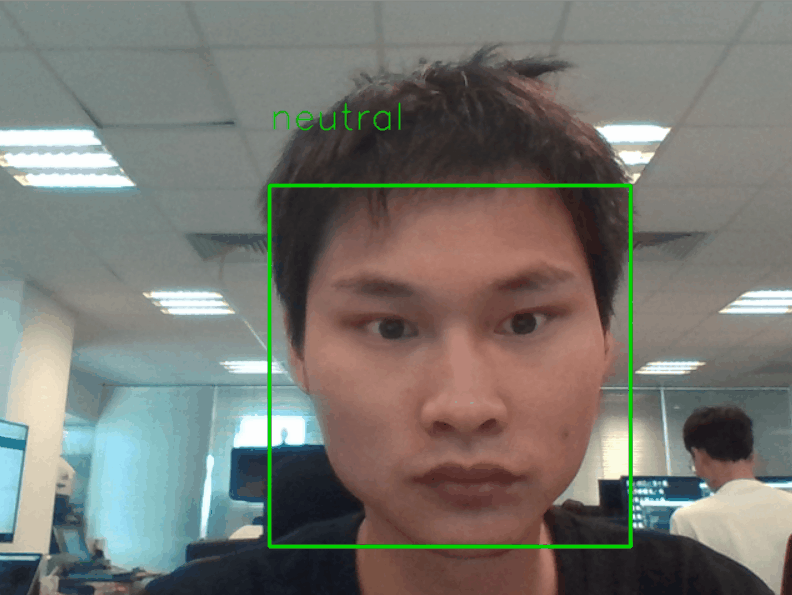

# Face classification
Modify from the [B-IT-BOTS robotics team](https://mas-group.inf.h-brs.de/?page_id=622)'s [demo](https://github.com/oarriaga/face_classification).

# Emotion/gender examples:

Guided back-prop

# Real-time emotion demo:

  

## Requirements:
>keras==2.0.5
>tensorflow==1.7.0
>pandas==0.19.1
>numpy==1.12.1
>h5py==2.7.0
>statistics
>opencv2-python==3.4.0

## Run:
> python3 video_emotion_color_demo.py

#Real-time-swapface demo:

  

## Requirements:
>keras==2.0.5
>tensorflow==1.7.0
>pandas==0.19.1
>numpy==1.12.1
>h5py==2.7.0
>statistics
>opencv2-python==3.4.0
>dlib

Install dlib with CPU version:
Download dlib whl files from [Links for dlib](https://pypi.org/simple/dlib/)
>pip install your_dlib_file.whl

Install dlib with GPU version(recommend): 
Confirm [cuda9.0+cudnn5.1],[cmake] and [vs2015 update3] already prepared 
>python setup.py install --yes DLIB_USE_CUDA

Download and unzip shape_predictor_68_face_landmarks.dat from [here](http://dlib.net/files/shape_predictor_68_face_landmarks.dat.bz2)

## Run:
> python3 video_emotion_color_swapface_demo.py